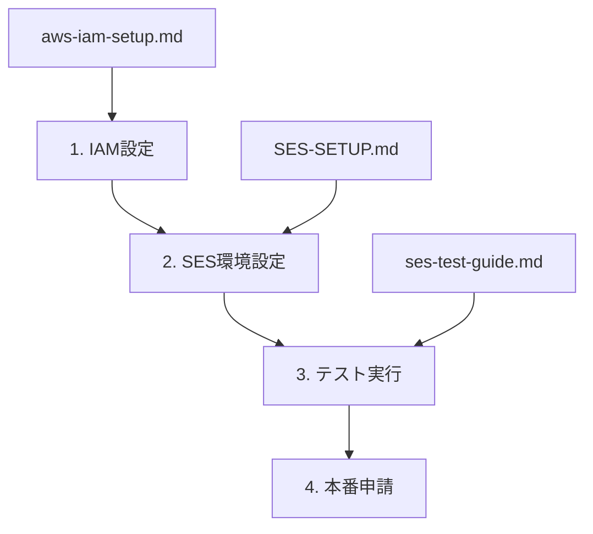

# 📖 Roamory ドキュメント

旅の記憶を残すアプリ「Roamory」のドキュメント集です。

## 🎯 **アプリケーション概要**

| ドキュメント                      | 内容                           | 対象者 |
| --------------------------------- | ------------------------------ | ------ |
| [アプリ概要](./アプリ概要.md)     | アプリの基本情報・機能一覧     | 全般   |
| [技術スタック](./技術スタック.md) | 使用技術・アーキテクチャ詳細   | 開発者 |
| [DB 設計](./DB設計.md)            | データベース設計・テーブル構成 | 開発者 |

## 🛠️ **AWS SES 設定ガイド**

| ドキュメント                            | 内容                                   | 対象者               |
| --------------------------------------- | -------------------------------------- | -------------------- |
| [SES 環境設定](./SES-SETUP.md)          | 🚀 **メイン設定ガイド** - 環境変数設定 | 開発者・運用者       |
| [IAM 設定手順](./aws-iam-setup.md)      | IAM ユーザー・ポリシー作成手順         | 開発者・運用者       |
| [IAM 比較分析](./aws-iam-comparison.md) | IAM ユーザー vs ロール詳細比較         | 開発者・アーキテクト |
| [SES テスト手順](./ses-test-guide.md)   | メール送信機能テスト実行手順           | 開発者・運用者       |

## 📋 **設定手順の流れ**

### **🏁 初回セットアップ**

### **🔄 運用・保守**

- 定期的なアクセスキーローテーション
- 本番アクセス制限監視
- メール送信統計確認

## 💡 **推奨読み順**

### **初めての方**

1. [アプリ概要](./アプリ概要.md) - Roamory を理解
2. [SES 環境設定](./SES-SETUP.md) - **最重要** - 環境構築
3. [SES テスト手順](./ses-test-guide.md) - 動作確認

### **技術詳細を知りたい方**

1. [技術スタック](./技術スタック.md) - アーキテクチャ理解
2. [DB 設計](./DB設計.md) - データ構造理解
3. [IAM 比較分析](./aws-iam-comparison.md) - セキュリティ設計理解

### **運用担当者**

1. [IAM 設定手順](./aws-iam-setup.md) - セキュリティ設定
2. [SES 環境設定](./SES-SETUP.md) - 環境構築
3. [SES テスト手順](./ses-test-guide.md) - 動作確認

## 🆘 **トラブルシューティング**

よくある問題と解決方法：

| 問題                   | 参照ドキュメント                        | セクション             |
| ---------------------- | --------------------------------------- | ---------------------- |
| メール送信エラー       | [SES テスト手順](./ses-test-guide.md)   | トラブルシューティング |
| 環境変数設定ミス       | [SES 環境設定](./SES-SETUP.md)          | トラブルシューティング |
| AWS 認証エラー         | [IAM 設定手順](./aws-iam-setup.md)      | セキュリティ設定       |
| ロール vs ユーザー選択 | [IAM 比較分析](./aws-iam-comparison.md) | 推奨戦略               |

## 📞 **サポート**

- **緊急時**: [SES 環境設定](./SES-SETUP.md)のトラブルシューティングを確認
- **設定方法**: 各ドキュメントの手順に従って実行
- **技術相談**: 開発チームまでお問い合わせください

---

🚀 **Happy Coding with Roamory!**
